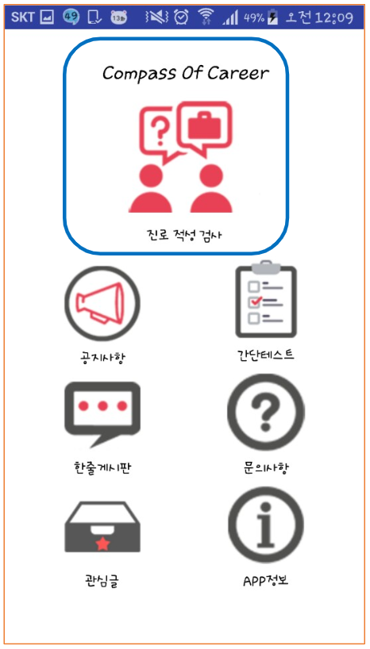

# 진로의 나침반(Compass of Career)

## Open Source Project - Blue House Team (2016)

2015244129 피구르 형태
2013244053 김민정
2011244106 지민
2013244110 정명구
2014671034 유가연
2015244008 심하은

## 앱 소개

진로 적성 검사 및 그 외 간단한 테스트 가능  
공지사항, 문의사항, 한 줄게시판 이용 가능

## 역할 분담

김민정 (코어 멤버)
- 전반적인 기능 구현
- 소스 분석 및 적용
- 버튼, 게시판 디자인

심하은 (코어 멤버)
- 뷰 전환 기능 연동
- UI 화면 배치
- 소스 분석 및 적용

유가연 (코어 멤버)
- 직업 검사 자료 조사
- 버튼, 초기화면 디자인

지민 (페리페럴 멤버)
- 버튼 클릭 이벤트 조사
- Toast 알림 띄우기 조사

피구르 형태 (페리페럴 멤버)
- 버튼 클릭 이벤트 조사
- 운세 연동 기능 조사

정명구 (코어 멤버)
- 간단 테스트 조사
- 진로,취업 정보 조사

## 애로 사항

- DB연동을 하지 못해서 데이터 저장에 어려움을 겪음
- 진로 적성 검사 문항이 공개 된 것이 많지 않아 자료 수집에 있어 어려움을 겪음
- 우리 어플만의 특이점에 대해서 만들어내지 못함 

## Skills

- I learned through this project and through the Open Source Class how to do teamwork on Github and how to work with open source
- Basics of Android Studio and Java
